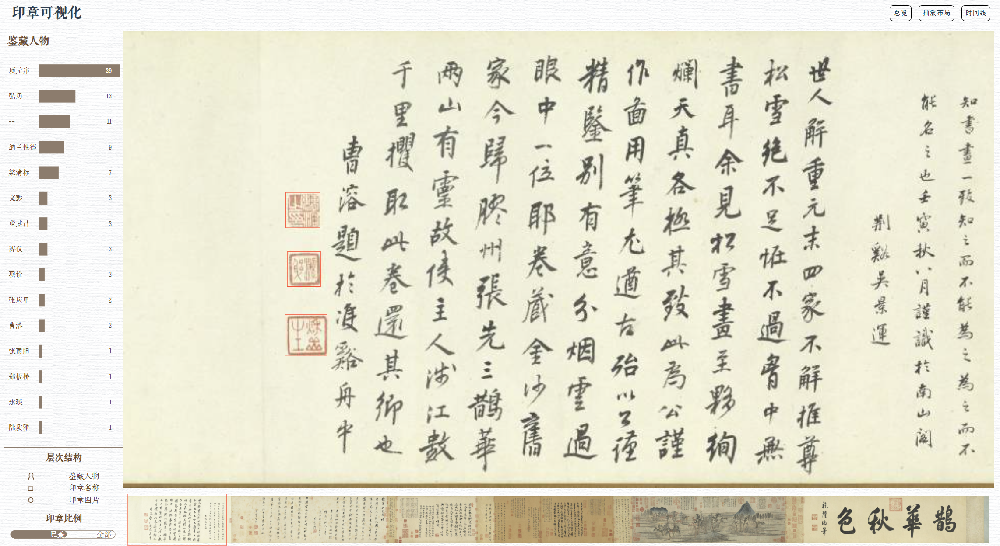
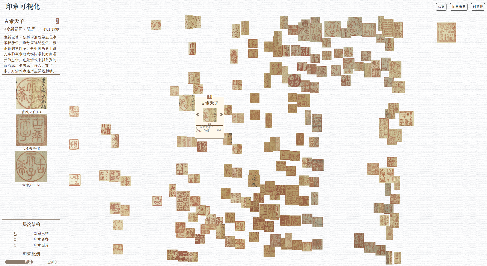
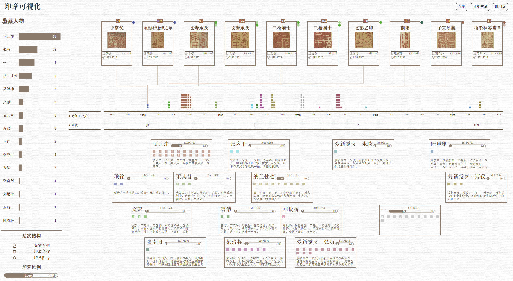

# Seal Visualization


This repository hosts the implementation for our final project in the **Data Visualization** course. 
We invite you to explore our online demonstration at [here (click to visit)](https://8023looker.github.io/seal_visualization/#/).

## Setup
```
cd ./web/
npm install
npm run serve
```

## Overview






